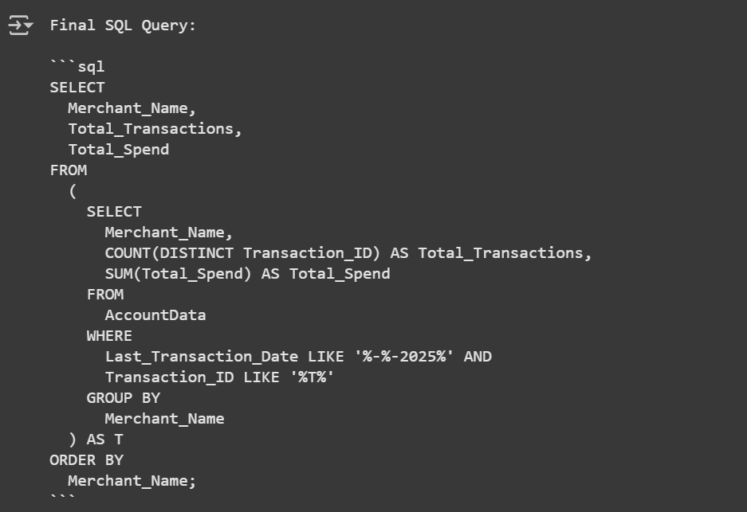

## SQL-code Generator Agent (RAG Based LLM Agent):

### Data
CSV File: sample_data.csv

### Database used for LLM Agent: 
ChromaDB

### LLM Used:
meta-llama/llama-3.2-1b-instruct

### Framework:
Autogen

### Problem it is solving: Functionality
Generates SQL Query for Tabular Data uploaded based on the Query asked.

Generate an SQL query for:
Get the account summary for each merchant name for the current month showing the total transactions and total spends. Additionally, once the query is executed, Provide the final SQL query, the output of the query for each distinct merchant, and a textual summary of the results. Don't show any intermediate python or sql code, show only final code output and its results summary and final SQL query.

